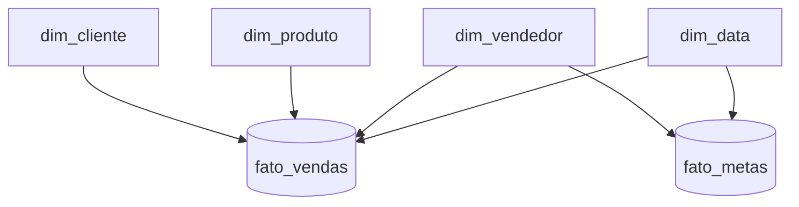
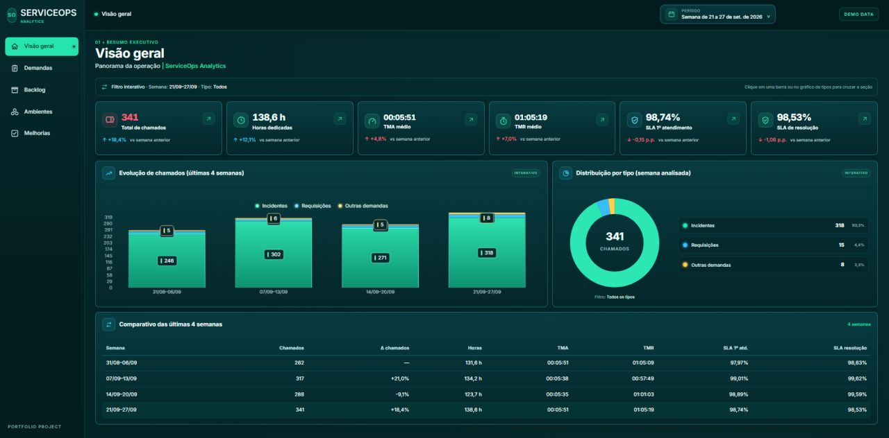
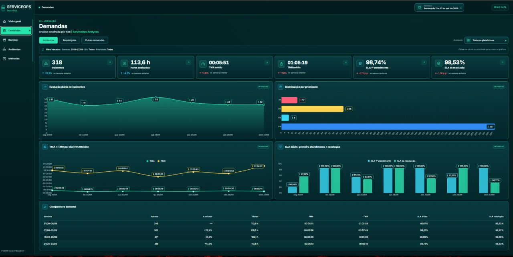
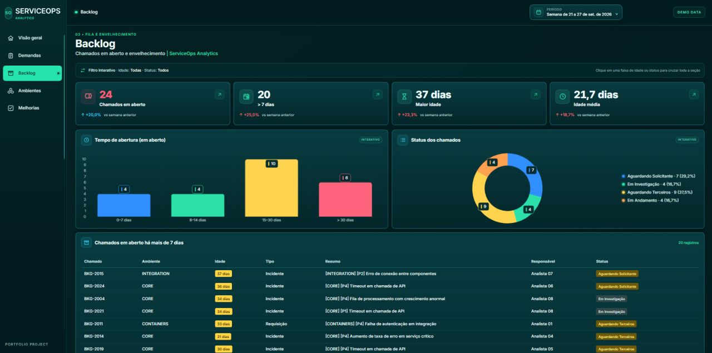
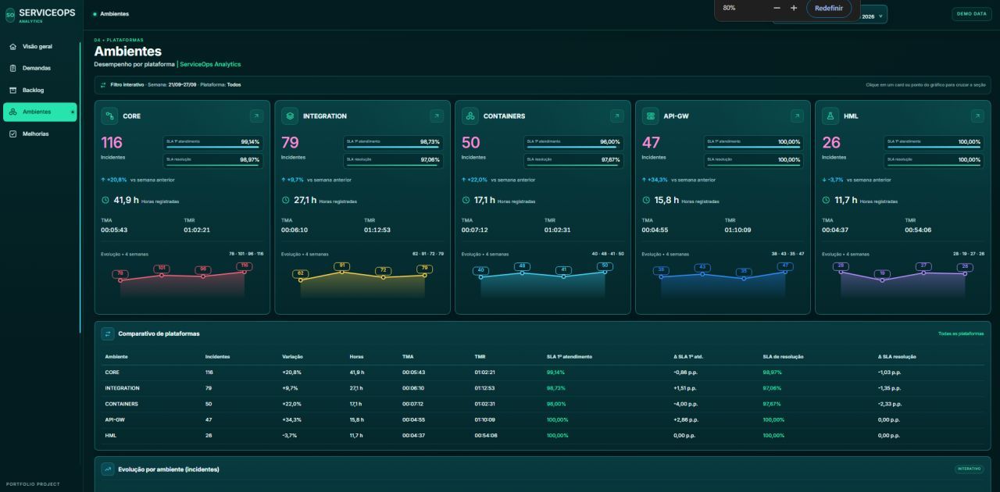
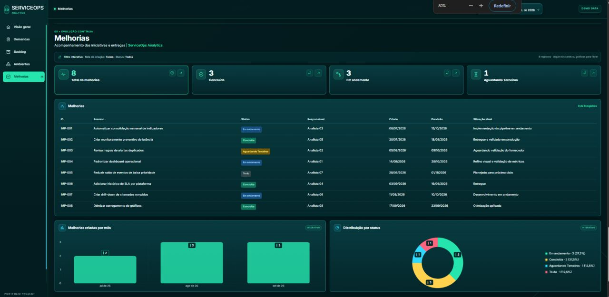

# Portfólio — Vinicius da Costa Soares

Showcase de projetos em Power BI, DAX, SQL e Python, com foco em resolver problemas de negócio de ponta a ponta (coleta → modelagem → visualização).

Linkedin: https://www.linkedin.com/in/vinicius-soares-5885b4215/

[](#)
[](#)
[](#)

 


## Sumário

- [Projeto 01 — Dashboard no Power BI](#-projeto-01--dashboard-no-power-bi)
- [Projeto 02 — Dashboard de Indicadores](#-projeto-02--dashboard-de-indicadores)
- [Projeto 03 — Dashboard com Python](#-projeto-03--dashboard-com-python)
- [Projeto 04 — Desafio Técnico BI Jr (JAAR Consult)](#-projeto-04--desafio-técnico-bi-jr-jaar-consult)
- [Projeto 05 — SQL (PostgreSQL) | Vendas e Funil](#-projeto-05--sql-postgresql--vendas-e-funil)
- [Projeto 06 — SQL (PostgreSQL) | Perfil dos Leads](#-projeto-06--sql-postgresql--perfil-dos-leads)
- [Projeto 07 — Aurora Analytics | BigQuery + Power BI](#-projeto-07--aurora-analytics--bigquery--power-bi)

## 🧭 Visão rápida 

| # | Projeto | Tema | Stack | Técnicas-chave | Links |
|---|---|---|---|---|---|
| 01 | 📊 Dashboard no Power BI | RH: funcionários, dependentes e salários | Power BI • Excel/CSV | Modelagem • KPIs • Segmentações (cargo/setor/UF) | 📁 [Pasta](projetos/Projeto1_Func/) • 📄 [Relatório](projetos/Projeto1_Func/relatorio/Projeto1_Func.docx) |
| 02 | 📈 Dashboard de Indicadores | KPIs e metas (visão executiva) | Power BI • DAX • Excel/CSV | DAX • KPIs • Análise de desvios vs meta | 📁 [Pasta](projetos/Projeto2_Case/) • 📄 [Dashboard](projetos/Projeto2_Case/relatorio/Projeto02-%20DashboarddeIndicadores.docx) • 🧾 [Case](projetos/Projeto2_Case/relatorio/Case%20Anal%C3%ADtico.docx) |
| 03 | 🐍 Dashboard com Python | Financeiro: coleta/atualização e dashboard | Python • Pandas • yfinance • Power BI | ETL em Python • Integração Python ↔ Power BI • Automação | 📁 [Pasta](projetos/Projeto3_Case/) • 📄 [Relatório](projetos/Projeto3_Case/relatorio/Doc_DashPython.docx) |
| 04 | 🏆 Desafio Técnico BI Jr (JAAR) | Vendas: análise, storytelling e governança | Power BI • DAX | Star Schema • Time Intelligence • RLS • Storytelling | 📁 [Pasta](projetos/Projeto4_Case/) • 📄 [Relatório](projetos/Projeto4_Case/relatorio/) |
| 05 | 🗄️ SQL (PostgreSQL) \| Vendas e Funil | KPI mensal + rankings (estado/marca/loja) | PostgreSQL • pgAdmin • Excel | CTEs • Joins • `date_trunc` • KPIs no banco | 📁 [Pasta](projetos/Projeto5_Case/) • 📄 [PDF](projetos/Projeto5_Case/assets/Projeto%20-%20DashboardDeVendas.pdf) • 📊 [Excel](projetos/Projeto5_Case/files/Projeto%20-%20DashboardDeVendas.xlsx) • 🧾 [Relatório SQL](projetos/Projeto5_Case/files/Projeto05_Relatorio_SQL_Queries.txt) |
| 06 | 🧠 SQL (PostgreSQL) \| Perfil dos Leads | Segmentação e distribuição (%) de leads | PostgreSQL • pgAdmin • Excel | CASE WHEN • Percentuais • Classificações • Ranking por marca | 📁 [Pasta](projetos/Projeto6_Case/) • 📄 [PDF](projetos/Projeto6_Case/assets/Projeto%20-%20PerfilDosLeads.pdf) • 📊 [Excel](projetos/Projeto6_Case/files/Projeto%20-%20PerfilDosLeads.xlsx) • 🧾 [Relatório SQL](projetos/Projeto6_Case/files/Projeto06_Relatorio_SQL_Queries.txt) |
| 07 | 🟢 Aurora Analytics — BigQuery + Power BI | Vendas, rentabilidade e performance comercial | **Google BigQuery • GoogleSQL • Power BI • DAX** | **RAW → DW • ELT • Star Schema • Clustering • Data Quality • MoM** | 📁 [Pasta](projetos/Projeto07_Aurora_Analytics/) • 📄 [Case](projetos/Projeto07_Aurora_Analytics/README.md) • 🧾 [SQL](projetos/Projeto07_Aurora_Analytics/sql/) |


---

# 🗂 Projeto 01 — **Dashboard no Power BI**

## 🎯 Objetivos do Case

- Consolidar as principais informações de **funcionários, dependentes e salários** em um único dashboard.
- Garantir uma modelagem de dados consistente, com relacionamentos corretos entre tabelas.
- Criar **KPIs estratégicos** (Total de Funcionários, Funcionários com Dependentes e Total de Salários).
- Disponibilizar análises por **cargo, setor e localidade**, permitindo diferentes perspectivas da base de dados.
- Fornecer uma visão clara, visual e interativa para apoiar a tomada de decisão.

### 📷 Preview  


## 🚀 Tecnologias Utilizadas

- **Power BI Desktop**  
- **Excel / CSV**  
- **Git & GitHub** para versionamento  

## 📊 Resultados e 💡 Insights

- Criação de um **dashboard interativo no Power BI** consolidando funcionários, dependentes e salários.  
- Implementação de **KPIs chave** (Total de Funcionários, Funcionários com Dependentes e Total de Salários).  
- Análise por **cargo, setor e localidade (UF)**, permitindo diferentes perspectivas da base.  

## 📖 Relatório 
- Link para o relatório completo : https://github.com/Vynys/portfolio-analista-dados/blob/main/projetos/Projeto1_Func/relatorio/Projeto1_Func.docx

---

# 🗂 Projeto 02 - Dashboard de Indicadores

## 🎯 Objetivos do Case
- Centralizar os principais **indicadores de desempenho (KPIs)**.  
- Identificar pontos abaixo da meta e sugerir melhorias.  
- Apresentar os resultados de forma clara e visual.  

## 📷 Preview  


## 🚀 Tecnologias Utilizadas
- **Power BI Desktop**  
- **Excel / CSV**  
- **DAX** para criação de métricas e KPIs  
- **Git & GitHub** para versionamento  

## 📊 Resultados e 💡 Insights
- Identificação dos KPIs abaixo da meta.
- Visualização clara de desempenho por categoria/segmento. 
- Base para recomendações estratégicas de melhoria.

## 📖 Relatório 
- Link para o relatório completo: https://github.com/Vynys/portfolio-analista-dados/blob/main/projetos/Projeto2_Case/relatorio/Projeto02-%20DashboarddeIndicadores.docx
- Link para o Case Analítico: https://github.com/Vynys/portfolio-analista-dados/blob/main/projetos/Projeto2_Case/relatorio/Case%20Anal%C3%ADtico.docx

---

# 🗂 Projeto 03 - Dashboard com Python

## 🎯 Objetivos do Case
- Integrar Python e Power BI em um fluxo analítico.
- Automatizar a coleta e atualização de dados financeiros.
- Criar um dashboard em tempo real para análise de ações.
- Demonstrar aplicação prática de scripts Python dentro do Power BI.

## 📷 Preview 


## 🚀 Tecnologias Utilizadas
- Python 3.x
- Pandas
- YFinance (Yahoo Finance API) 
- Virtualenv
- Power BI Desktop
- Git & GitHub para versionamento

## 📊 Resultados e 💡 Insights
- Integração bem-sucedida entre Python e Power BI.
- Automação da coleta e atualização de dados financeiros.
- Demonstração prática de habilidades técnicas em Python, DAX e Power BI.

## 📖 Relatório 
- Link para o relatório completo: https://github.com/Vynys/portfolio-analista-dados/blob/main/projetos/Projeto3_Case/relatorio/Doc_DashPython.docx

  ---

# 🗂 Projeto 04 — Desafio Técnico BI Jr (JAAR Consult)

## 🎯 Objetivos do Case
- Demonstrar domínio de **modelagem de dados (Star Schema)** no Power BI.  
- Criar e aplicar **medidas DAX** para métricas de vendas, custos, margens e descontos.  
- Implementar **análises de Time Intelligence** (YTD, LY, % vs LY e LY Exato).  
- Construir um **painel analítico interativo** com storytelling visual e foco em insights de negócio.  
- Utilizar **RLS estático e dinâmico** para controle de acesso a dados.

## 📷 Preview


## 🚀 Tecnologias Utilizadas
- Power BI Desktop (versão 2025)  
- Linguagem **DAX**  
- Modelagem relacional (**Star Schema**)  
- Recursos de **Time Intelligence**  
- Implementação de **RLS (Row-Level Security)**  
- Git & GitHub para versionamento  

## 📊 Resultados e 💡 Insights
- Construção de um painel limpo e eficiente para análise de **vendas líquidas, custos e margens**.  
- Identificação das **categorias e continentes com maior participação nas vendas (Share %)**.  
- Aplicação prática do **princípio de Pareto (80/20)** para priorização de produtos.  
- Implementação de análises comparativas **YTD vs LY Exato** e de **promoções mais rentáveis**.  
- Demonstração de **domínio em DAX**, storytelling e boas práticas de modelagem.

## 📖 Relatório
- Link para o relatório completo: https://github.com/Vynys/portfolio-analista-dados/tree/main/projetos/Projeto4_Case/relatorio
- Contexto: Projeto desenvolvido como parte de um **desafio técnico para processo seletivo da JAAR Consult**.  
  Todo o conteúdo é autoral e não representa oficialmente a empresa
  ---
# 🗂 Projeto 05 — SQL (PostgreSQL) | Análise de Vendas e Funil 

## 🧾 Visão geral
Este projeto é **SQL-first**: toda a transformação, cálculo de métricas e consolidação dos dados foi feita no **PostgreSQL**, utilizando **pgAdmin** como interface de desenvolvimento e validação das consultas.  
O **Excel** foi usado apenas como **camada de apresentação**, para tornar os resultados legíveis (tabelas e gráficos) e facilitar o consumo por stakeholders não técnicos.

## 🧰 Stack e ferramentas
- PostgreSQL (consultas analíticas)
- pgAdmin (Query Tool, validação e exportação de resultados)
- Excel (apresentação / dashboard e relatório em PDF)

## 🗃️ Base de dados (tabelas utilizadas)
- `sales.funnel` (visitas, funil e datas de conversão/pagamento)
- `sales.products` (preço, marca e atributos do produto)
- `sales.customers` (estado do cliente)
- `sales.stores` (lojas)

## 🎯 Objetivo de negócio
Construir uma visão gerencial de performance de vendas e funil, respondendo:
- Como evoluem **leads, vendas e receita** mês a mês?
- Qual a **conversão** do funil e o **ticket médio**?
- Quais **estados**, **marcas** e **lojas** puxaram as vendas no mês analisado?
- Em quais **dias da semana** há maior volume de visitas?

## 📷 Preview
  
  


## 🧠 O que foi feito em SQL (destaques técnicos)
- **CTEs** para organizar a lógica e garantir rastreabilidade (ex.: `leads`, `payments`)
- **Agregações** com `COUNT()` e `SUM()` para métricas-chave
- **Cálculos de KPI** no banco (conversão e ticket médio), com `CAST`/`::float` para evitar divisão inteira
- **Time intelligence** com `date_trunc('month', ...)` para padronização mensal
- **Business filtering** por período (ex.: agosto/2021) para rankings de performance
- **Dimensional joins** (`funnel` ↔ `products/customers/stores`) para enriquecer as análises

## 🧩 Consultas (perguntas respondidas)
As consultas deste projeto geram:
1. **Receita, leads, conversão e ticket médio mês a mês**
2. **Top 5 estados** com mais vendas (mês)
3. **Top 5 marcas** com mais vendas (mês)
4. **Top 5 lojas** com mais vendas (mês)
5. **Dias da semana** com maior número de visitas  
(As queries estão documentadas no arquivo de consultas do projeto.)

## 📦 Entregáveis
- Dashboard em Excel (apresentação dos resultados extraídos via SQL)
- PDF do relatório/dash
- Scripts SQL (consultas do projeto)

## 📖 Relatório
- Link para o PDF: https://github.com/Vynys/portfolio-analista-dados/blob/main/projetos/Projeto5_Case/assets/Projeto%20-%20DashboardDeVendas.pdf
- Link para o Excel: https://github.com/Vynys/portfolio-analista-dados/blob/main/projetos/Projeto5_Case/files/Projeto%20-%20DashboardDeVendas.xlsx
- Link para o Relatório Completo: https://github.com/Vynys/portfolio-analista-dados/blob/main/projetos/Projeto5_Case/files/Projeto05_Relatorio_SQL_Queries.txt


---

# 🗂 Projeto 06 — SQL (PostgreSQL) | Perfil dos Leads 
## 🧾 Visão geral
Este projeto é **SQL-first**: toda a segmentação, cálculos de distribuição (%) e consolidação do perfil dos leads foram feitos no **PostgreSQL**, utilizando **pgAdmin** para desenvolvimento, validação e extração dos resultados.  
O **Excel** foi usado apenas como **camada de apresentação**, para transformar os resultados do SQL em tabelas e gráficos legíveis para o leitor.

## 🧰 Stack e ferramentas
- PostgreSQL (consultas analíticas e segmentação)
- pgAdmin (Query Tool, validação e exportação de resultados)
- Excel (apresentação / dashboard e relatório em PDF)

## 🗃️ Base de dados (tabelas utilizadas)
- `sales.customers` (dados do lead: renda, nascimento, status profissional, etc.)
- `temp_tables.ibge_genders` (mapeamento de gênero por primeiro nome)
- `sales.funnel` (eventos de visita / navegação)
- `sales.products` (marca, modelo, ano do veículo)

## 🎯 Objetivo de negócio
Construir uma visão de **perfil e comportamento** dos leads, respondendo:
- Qual a distribuição de leads por **gênero**?
- Qual o **status profissional** predominante e sua participação (%)?
- Como os leads se distribuem por **faixa etária** e **faixa salarial**?
- Quais veículos foram mais visitados e como se comportam por **classificação** (novo vs seminovo)?
- Quais modelos são mais visitados por **marca**?
  
## 📷 Preview
  
  


## 🧠 O que foi feito em SQL (destaques técnicos)
- **CTEs** para organizar regras e manter a consulta legível (ex.: classificação do veículo, faixas)
- **CASE WHEN** para criar categorias de negócio (faixa etária, faixa salarial, status, classificação)
- **Cálculo de percentuais** diretamente no banco (`COUNT(*)::float / total`)
- **Regras de classificação** (ex.: “novo até 2 anos”, “seminovo acima de 2 anos”)
- **Joins dimensionais** (`customers/funnel/products`) para enriquecer o comportamento de navegação
- **Ordenação e ranking** para identificar itens mais visitados por marca

## 🧩 Consultas (perguntas respondidas)
As consultas deste projeto geram:
1. **Distribuição por gênero** dos leads
2. **Status profissional** (% de participação)
3. **Faixa etária** (% de participação)
4. **Faixa salarial** (% de participação)
5. **Classificação do veículo visitado** (novo vs seminovo)
6. **Faixa de idade do veículo visitado** (%)
7. **Veículos mais visitados por marca**  
(As queries estão documentadas no arquivo de consultas do projeto.)

## 📦 Entregáveis
- Dashboard em Excel (apresentação dos resultados extraídos via SQL)
- PDF do relatório/dash
- Scripts SQL (consultas do projeto)

## 📖 Relatório
  * Link para o PDF: https://github.com/Vynys/portfolio-analista-dados/blob/main/projetos/Projeto6_Case/assets/Projeto%20-%20PerfilDosLeads.pdf
  * Link para o Excel: https://github.com/Vynys/portfolio-analista-dados/blob/main/projetos/Projeto6_Case/files/Projeto%20-%20PerfilDosLeads.xlsx
  * Link para o Relatório Completo: https://github.com/Vynys/portfolio-analista-dados/blob/main/projetos/Projeto6_Case/files/Projeto06_Relatorio_SQL_Queries.txt

---

# 🟢 Projeto 07 — Aurora Analytics | BigQuery + Power BI

## 🧾 Visão geral

Projeto **end-to-end de análise comercial** desenvolvido para uma empresa fictícia de varejo europeu.

O diferencial técnico deste case é o uso do **Google BigQuery como camada central de dados**, e não apenas como uma fonte conectada ao Power BI.

A arquitetura foi estruturada em duas camadas:

```text
CSVs fictícios
      ↓
BigQuery — aurora_raw
      ↓
GoogleSQL / ELT
      ↓
BigQuery — aurora_dw
      ↓
Power BI
      ↓
Dashboard executivo
```

O Power BI consome a camada **DW já tratada**, enquanto as transformações, validações e regras principais de preparação dos dados ficam concentradas no **BigQuery**.

Todos os dados são **100% fictícios** e foram criados exclusivamente para fins de portfólio.

---

## ⭐ BigQuery — principal diferencial do projeto

Neste projeto, o **BigQuery foi utilizado como ambiente de Data Warehouse em cloud**, cobrindo ingestão, transformação, organização e validação dos dados antes do consumo no Power BI.

### Estrutura criada no BigQuery

#### Dataset `aurora_raw`
Camada destinada aos dados brutos importados dos arquivos CSV:

- `aurora_raw.vendas`
- `aurora_raw.clientes`
- `aurora_raw.produtos`
- `aurora_raw.vendedores`
- `aurora_raw.metas`

#### Dataset `aurora_dw`
Camada analítica preparada para consumo:

- `aurora_dw.fato_vendas`
- `aurora_dw.fato_metas`
- `aurora_dw.dim_cliente`
- `aurora_dw.dim_produto`
- `aurora_dw.dim_vendedor`
- `aurora_dw.dim_data`

Essa separação **RAW → DW** evita utilizar arquivos locais diretamente no Power BI e simula uma arquitetura mais próxima de um ambiente corporativo.

---

## 🧠 O que foi feito em SQL / GoogleSQL

A transformação foi realizada diretamente no BigQuery utilizando **GoogleSQL**.

### 1. Construção da tabela fato

A `fato_vendas` foi criada a partir de `aurora_raw.vendas`, incluindo:

- conversão de tipos com `CAST`;
- padronização da data de venda com `DATE()`;
- cálculo de **venda bruta**;
- cálculo de **valor de desconto**;
- cálculo de **receita líquida**;
- cálculo de **custo do produto**;
- cálculo de **lucro bruto**;
- organização física com `CLUSTER BY`.

Exemplo da lógica aplicada:

```sql
ROUND(
  quantidade * preco_unitario * (1 - percentual_desconto),
  2
) AS receita_liquida
```

```sql
ROUND(
  quantidade * preco_unitario * (1 - percentual_desconto)
  - quantidade * custo_unitario
  - custo_frete,
  2
) AS lucro_bruto
```

A tabela fato final foi organizada com clustering por:

```sql
CLUSTER BY
  id_cliente,
  id_produto,
  id_vendedor
```

---

### 2. Construção da dimensão calendário

A `dim_data` foi criada diretamente no BigQuery a partir do intervalo real da base.

Foram utilizadas funções como:

- `MIN()`
- `MAX()`
- `GENERATE_DATE_ARRAY()`
- `UNNEST()`
- `EXTRACT()`
- `FORMAT_DATE()`

A dimensão passou a fornecer:

- data;
- ano;
- trimestre;
- mês;
- número do mês;
- ano/mês;
- chave de ordenação mensal;
- semana ISO;
- dia do mês.

Exemplo:

```sql
WITH limites AS (
  SELECT
    MIN(data_pedido) AS data_minima,
    MAX(data_pedido) AS data_maxima
  FROM `aurora-analytics-portfolio.aurora_raw.vendas`
)
```

```sql
UNNEST(
  GENERATE_DATE_ARRAY(data_minima, data_maxima)
) AS d
```

---

### 3. Validação e Data Quality

As tabelas foram validadas diretamente no BigQuery antes da atualização do Power BI.

Foram utilizadas consultas com:

```sql
MIN(data_pedido)
MAX(data_pedido)
COUNT(*)
COUNT(DISTINCT id_pedido)
SUM(receita_liquida)
SUM(lucro_bruto)
SAFE_DIVIDE()
```

Exemplo de validação final:

```sql
SELECT
  MIN(data_pedido) AS primeira_data,
  MAX(data_pedido) AS ultima_data,
  COUNT(*) AS total_linhas,
  COUNT(DISTINCT id_pedido) AS total_pedidos,
  ROUND(SUM(receita_liquida), 2) AS receita_total,
  ROUND(SUM(lucro_bruto), 2) AS lucro_bruto,
  ROUND(
    SAFE_DIVIDE(
      SUM(lucro_bruto),
      SUM(receita_liquida)
    ) * 100,
    2
  ) AS margem_bruta_pct
FROM `aurora-analytics-portfolio.aurora_dw.fato_vendas`;
```

Validação final da camada DW:

- **77.147 linhas**
- **46.000 pedidos**
- período entre **01/01/2024 e 20/09/2026**
- **€ 33,37 Mi** de receita
- **~€ 10,55 Mi** de lucro bruto
- **31,6%** de margem bruta

---

## 🛠️ Troubleshooting no BigQuery Sandbox

Durante o desenvolvimento, a `fato_vendas` foi inicialmente criada com:

```sql
PARTITION BY data_pedido
```

No ambiente **BigQuery Sandbox**, as partições históricas acabavam expirando, fazendo a camada DW manter apenas a janela mais recente dos dados.

O problema foi identificado comparando:

```sql
MIN(data_pedido)
MAX(data_pedido)
COUNT(*)
```

entre:

```text
aurora_raw.vendas
```

e:

```text
aurora_dw.fato_vendas
```

A RAW possuía todo o histórico desde 2024, enquanto a fato mantinha apenas registros recentes.

A solução aplicada foi:

- remover o particionamento da `fato_vendas`;
- recriar a tabela a partir da camada RAW;
- manter `CLUSTER BY`;
- executar novamente as consultas de validação;
- confirmar a recuperação das **77.147 linhas**.

Esse processo demonstrou não apenas criação de queries, mas também **diagnóstico de problema, leitura da arquitetura e troubleshooting dentro do BigQuery**.

---

## ⭐ Modelagem de dados

O modelo foi estruturado em **Star Schema**.



A tabela `fato_vendas` concentra as métricas comerciais e se relaciona às dimensões de:

- Data
- Cliente
- Produto
- Vendedor

---

## 📊 Power BI

Depois da preparação da camada DW no BigQuery, o Power BI foi utilizado para:

- criação do modelo semântico;
- relacionamentos do Star Schema;
- criação das medidas DAX;
- Time Intelligence;
- comparativos mensais;
- filtros interativos;
- visualização e storytelling executivo.

### KPIs

- Receita Total
- Lucro Bruto
- Margem Bruta %
- Pedidos
- Ticket Médio

### Análises

- Evolução do Faturamento
- Quantidade de Pedidos
- Receita por Categoria
- Receita por País
- Desempenho por País e Canal
- Top 5 Vendedores

### Filtros

- País
- Período
- Canal

---

## 🧮 DAX

Principais medidas:

```DAX
Receita Total =
SUM ( fato_vendas[receita_liquida] )
```

```DAX
Lucro Bruto =
SUM ( fato_vendas[lucro_bruto] )
```

```DAX
Margem Bruta % =
DIVIDE ( [Lucro Bruto], [Receita Total] )
```

```DAX
Pedidos =
DISTINCTCOUNT ( fato_vendas[id_pedido] )
```

```DAX
Ticket Médio =
DIVIDE ( [Receita Total], [Pedidos] )
```

Também foram implementadas medidas para:

- mês de referência;
- período comparável;
- variação contra o mês anterior;
- comparação de margem em pontos percentuais;
- cores condicionais positivas e negativas.

---

## 📷 Preview

### Visão Geral



### Demandas



### Backlog



### Ambientes



### Melhorias



> Todos os dados exibidos neste projeto são 100% sintéticos e foram criados exclusivamente para demonstração e portfólio.

---

## 📊 Resultados

| Indicador | Resultado |
|---|---:|
| Receita Total | **€ 33,37 Mi** |
| Lucro Bruto | **~€ 10,55 Mi** |
| Margem Bruta | **31,6%** |
| Pedidos | **46.000** |
| Ticket Médio | **€ 725,49** |
| Linhas em `fato_vendas` | **77.147** |
| Período | **Jan/2024 a Set/2026** |

---

## 💡 Insights

- O canal **Online** concentra o maior volume de receita.
- A **Irlanda** apresenta a maior receita entre os países analisados.
- A margem bruta consolidada é de aproximadamente **31,6%**.
- O histórico mensal permite identificar picos e quedas que não seriam percebidos em uma janela curta.
- Os filtros de País, Período e Canal permitem aprofundar rapidamente a análise comercial.
- O ranking de vendedores evidencia os principais responsáveis pela geração de receita.

---

## 🚀 Tecnologias utilizadas

- **Google BigQuery**
- **GoogleSQL**
- **Power BI Desktop**
- **DAX**
- **Power Query**
- **Star Schema**
- **Git & GitHub**

---

## 📦 Entregáveis

- Dashboard Power BI
- Scripts GoogleSQL
- Arquitetura RAW / DW
- Modelagem Star Schema
- Medidas DAX
- Consultas de validação / Data Quality
- Dicionário de dados
- README técnico
- Arquivo `.pbix`

---

## 📖 Projeto completo

- 📁 [Abrir pasta do projeto](projetos/Projeto07_Aurora_Analytics/)
- 📄 [README técnico](projetos/Projeto07_Aurora_Analytics/README.md)
- 🧾 [Scripts SQL](projetos/Projeto07_Aurora_Analytics/sql/)
- 📐 [Medidas DAX](projetos/Projeto07_Aurora_Analytics/dax/medidas_dax.md)
- 📚 [Dicionário de dados](projetos/Projeto07_Aurora_Analytics/docs/dicionario_dados.md)

---

## 🧰 Competências demonstradas

**Google BigQuery • GoogleSQL • Cloud Data Warehouse • RAW/DW Architecture • ELT • SQL • Clustering • Data Quality • Troubleshooting • Star Schema • Power BI • DAX • Power Query • Data Visualization • Storytelling**

