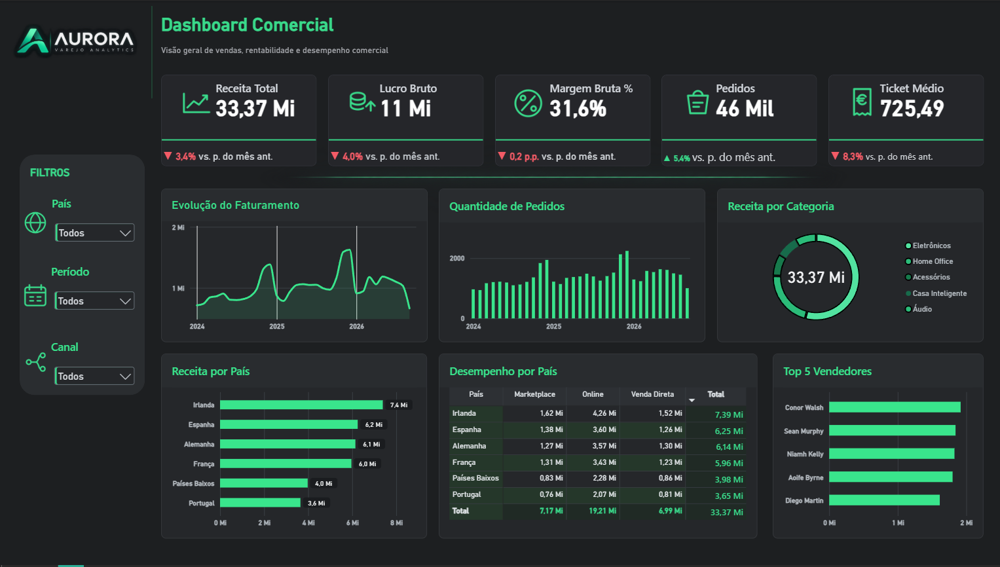
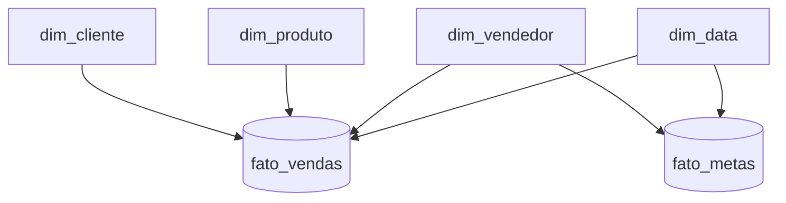

# Projeto 07 — Aurora Analytics | BigQuery + Power BI

> Projeto de portfólio end-to-end de análise comercial para uma empresa fictícia de varejo europeu, cobrindo ingestão, modelagem, transformação SQL, métricas DAX e visualização executiva em Power BI.



## Visão geral

A **Aurora Analytics** é uma empresa fictícia criada para demonstrar, em um único case, competências práticas de **Análise de Dados, SQL, BigQuery, modelagem dimensional, DAX e Power BI**.

### Indicadores principais

| Indicador | Resultado |
|---|---:|
| Receita total | € 33,37 Mi |
| Lucro bruto | ~€ 10,55 Mi |
| Margem bruta | 31,6% |
| Pedidos | 46.000 |
| Ticket médio | € 725,49 |
| Período analisado | Jan/2024 a Set/2026 |
| Linhas em `fato_vendas` | 77.147 |

> Todos os dados utilizados são **fictícios** e foram criados exclusivamente para fins de portfólio.

## Objetivos do projeto

- Construir uma arquitetura analítica simples e reproduzível.
- Organizar dados brutos e camada de Data Warehouse no BigQuery.
- Aplicar SQL para transformação, cálculo de métricas e validação.
- Modelar o Power BI em esquema estrela.
- Criar KPIs executivos e comparativos mensais com DAX.
- Desenvolver um dashboard de uma página, com foco em leitura rápida e storytelling.

## Stack

- Google BigQuery
- SQL (GoogleSQL)
- Power BI Desktop
- DAX
- Power Query
- Git / GitHub

## Arquitetura


## Modelagem



## Dashboard

### KPIs
- Receita Total
- Lucro Bruto
- Margem Bruta %
- Pedidos
- Ticket Médio
- Comparativo mensal com formatação condicional

### Análises
- Evolução do Faturamento
- Quantidade de Pedidos
- Receita por Categoria
- Receita por País
- Desempenho por País e Canal
- Top 5 Vendedores

### Filtros
- País
- Período
- Canal

## Decisões técnicas relevantes

### BigQuery Sandbox e particionamento

A `fato_vendas` foi inicialmente particionada por `data_pedido`. No ambiente BigQuery Sandbox, isso eliminava as partições históricas. Para preservar todo o histórico em um projeto 100% gratuito, a fato final foi mantida **sem particionamento** e com clustering.

O histórico final cobre **01/01/2024 a 20/09/2026**.

## Principais medidas DAX

```DAX
Receita Total =
SUM ( fato_vendas[receita_liquida] )
```

```DAX
Lucro Bruto =
SUM ( fato_vendas[lucro_bruto] )
```

```DAX
Margem Bruta % =
DIVIDE ( [Lucro Bruto], [Receita Total] )
```

```DAX
Pedidos =
DISTINCTCOUNT ( fato_vendas[id_pedido] )
```

```DAX
Ticket Médio =
DIVIDE ( [Receita Total], [Pedidos] )
```

As medidas adicionais estão em [`dax/medidas_dax.md`](dax/medidas_dax.md).

## Validações

- 77.147 linhas
- 46.000 pedidos
- € 33,37 Mi de receita
- ~€ 10,55 Mi de lucro bruto

## Insights

- O canal Online concentra o maior volume de receita.
- A Irlanda apresenta a maior receita entre os países da base.
- A margem bruta consolidada é de aproximadamente 31,6%.
- O histórico mensal permite visualizar melhor picos e quedas de faturamento.
- Os filtros de País, Período e Canal permitem aprofundar a análise.

## Estrutura do projeto

```text
Projeto07_Aurora_Analytics/
├── README.md
├── assets/
│   ├── dashboard-aurora.png
│   └── modelo-estrela.png
├── sql/
├── dax/
├── docs/
└── data/
```

## Como reproduzir

1. Carregue os CSVs fictícios em `aurora_raw`.
2. Execute os scripts SQL.
3. Conecte o Power BI ao dataset `aurora_dw`.
4. Configure o Star Schema.
5. Crie as medidas DAX.
6. Atualize e valide os visuais.

## Arquivo Power BI

O arquivo `.pbix` final está disponível na release oficial do projeto:

**[Baixar Aurora_Varejo_Analytics.pbix — Release v1.0](../../releases/tag/aurora-v1.0.0)**
## Competências demonstradas

**BigQuery • SQL • ELT • Star Schema • Power BI • DAX • Power Query • Data Visualization • Storytelling • Data Quality • Git/GitHub**
